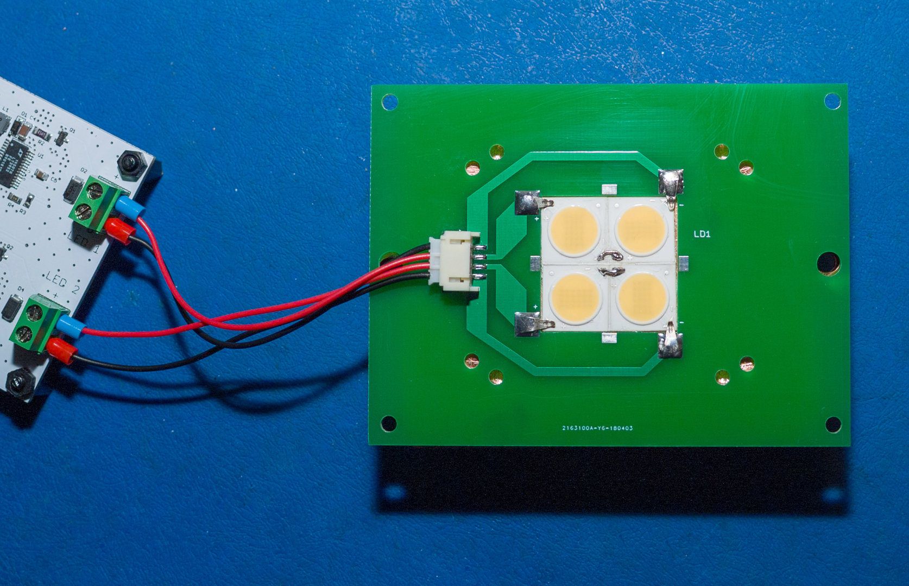

# LED Light Source

The LED light source component uses [Yuji LEDs](https://store.yujiintl.com/). More specifically their VTC (CRI 98) LEDs in [COB package for 5600K](YJWJ040-1.0_YJ-VTC-135L-G01.pdf) correlated colour temperature. A package of 4xVTC LED COBs clustered together is used for this light source. For more technical details on individual COB specifications see [Yuji LED web store](https://store.yujiintl.com/collections/vtc-series/products/vtc-series-high-cri-cob-led-135l-pack-5-pcs?variant=45426214099).

These LEDs were chosen for the broad spectrum coverage they provide. An example of spectral response captured from the LEDs used in this setup ([also available as .CSV file](VTC5600_spectrum.csv)):

This component consists of two distinct and connected parts - LED driver/controller board and LED light head assembly. The whole circuit requires +12V/5A DC power supply to operate.

The photo below gives a clearer idea of the asssembled setup:

### LED Driver Board

The LED driver/controller board is a standalone LED driver with PWM control and 4000:1 dimming ratios (programmatically controlled). The LED driver board has two constant current channels - each capable of driving 450mA LEDs with up to 50V. This setup uses 2x LED strings (one per each channels) with 2xLEDs in series in each string (4x LEDs in total).

The board has 4 pin PWM connector allowing to control LED heatsink fan (if it is used). It also features I2C temperature sensor connector for board/environment temperature monitoring (if used) and 1-Wire thermocouple interface connector for LED temperature monitoring (if used).

Board schematic is also [available as standalone PDF](LED.pdf). Bill of material [is available in Excel format](LED_BOM.xlsx).

The following are the board layouts available (generated by OSH Park preview):

 

### LED Light Head Assembly

This assembly utilises the board with connector to the main LED driver board and mechanical connectors to 4xVTC LED COBs mounted directly on heatsink. The board has square cutout that fits tightly around 2x2 layout of VTC LED COBs with metallic pins soldered to the board acting as mechanical connectors to the LEDs. This allows to keep LEDs and heatsink setup separate from the board and optical assembly for easier replacement of the parts. The LED COBs are connected in series of two per string. 

The LED COBs are glued to a heatsink directly with [Arctic Silver Thermal Adhesive](http://www.arcticsilver.com/arctic_silver_thermal_adhesive.htm) in a tightly formed cluster. In series connection for each pair is formed by direct wire soldering onto the LEDs. This photo illustrates the setup:

 

The board with soldered pins on top of LEDs mounted on heatsink as follows:

 

The board then has a range of holes to allow attachments of the reflector, condenser lens and holder. Below is the example of the fully assembled setup:

