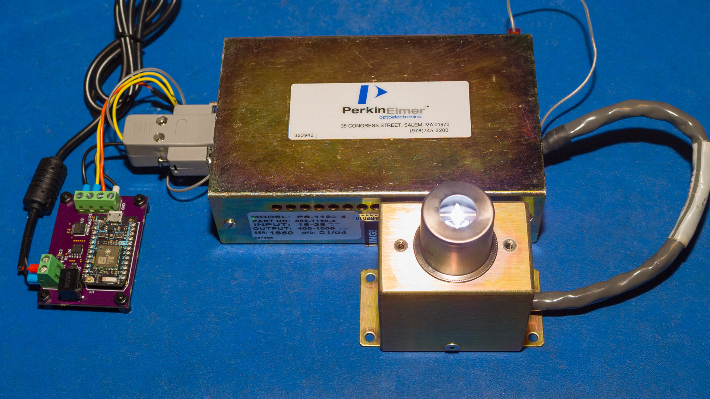
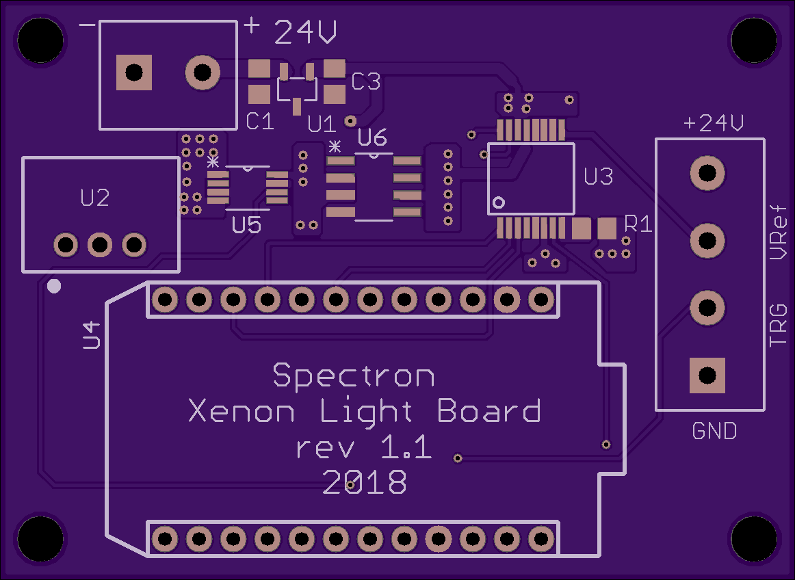
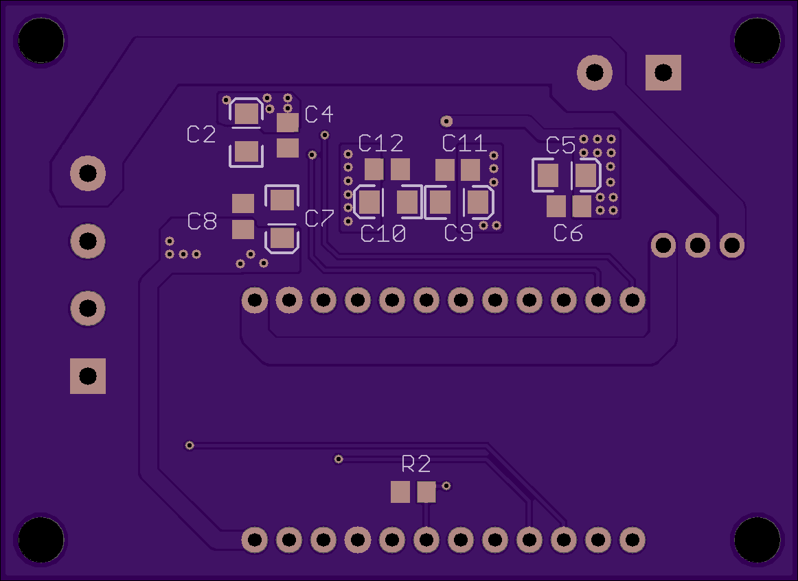

# Xenon Light Source

The Xenon light source component utilises compact pulsed guided short arc Xenon lamp with build in reflector. There are several manufacturers of those lamps - [Hamamatsu](https://www.hamamatsu.com/eu/en/product/light-and-radiation-sources/lamp/xenon-flash-lamp/index.html) and [Excelitas/Perkin-Elmer](http://www.excelitas.com/Pages/Product/1100-Series-Family.aspx) are well known for their expertise in this area. The setup built and tested for the Spectron 2 utilises [Excelitas/Perkin-Elmer](http://www.excelitas.com/) lamps simply because the off-the-shelf components for them are much easier to find reasonably priced on second hand market (eBay is a great source for them).

This light source construction makes it a very efficient light source for monochromator with very little light loss even without special complicated collimating optics. The metal can lamps from the families referenced above also allow to exceed to a certain degree rated power parameters when lamp is mounted on cooling jackets with sufficient thermal mass. This was tested and fully exploited in firmware accompanying this light sources to provide more efficient light output.

This light source uses [Excelitas/Perkin-Elmer FX-1160 (arc length 1.5mm) or FX-1163 (arc length 3mm) lamps](http://www.excelitas.com/Pages/Product/1100-Series-Family.aspx) widely available new on [eBay at reasonable prices](https://www.ebay.com/itm/Excelitas-FX-1163RT-High-Output-Short-Arc-Xenon-Flashlamp-Flashtube-New-in-Box/122220610629). The lamp also needs a corresponding high voltage (400-1000V) power supply and high voltage trigger module. In our case the [Excelitas/Perkin-Elmer PS-1120 high voltage power supply](http://www.excelitas.com/Downloads/DTS_1100Series_Power_Supplies.pdf) was used together with [Excelitas/Perkin-Elmer FYD‐1150‐B high voltage trigger module](http://www.excelitas.com/Downloads/DTS_1100Series_Trigger_Modules.pdf). The controller board was made to allow to programmatically control the output voltage and triggering rate.

The whole light source component requires external +24V/3A DC power supply to operate.

The pictures below give a clearer idea of the asssembled setup for this component with the lamp triggering:

The controller board uses 0-10V DAC to set output voltage of the high voltage power supply - these power supplies tend to use voltage reference of 1/100th of the desired output to control the output voltage. The board has 2 pin connector to the exnternal +24V DC power supply and 4 pin connector to the high voltage power supply driving the lamp. The output 4 pin connector provides +24V DC, non-isolated logic level trigger signal and 0-10V voltage reference. The [Excelitas/Perkin-Elmer PS-1120 high voltage power supply](http://www.excelitas.com/Downloads/DTS_1100Series_Power_Supplies.pdf) used here has isolated trigger input so no extra isolation is needed. However external trigger signal isolation may be needed (via optocoupler) if a different high voltage power supply is used.

Board schematic is also [available as standalone PDF](Xenon_Light.pdf). Bill of material [is available in Excel format](Xenon_Light_BOM.xlsx).

The following are the board layouts available (generated by OSH Park preview):

 