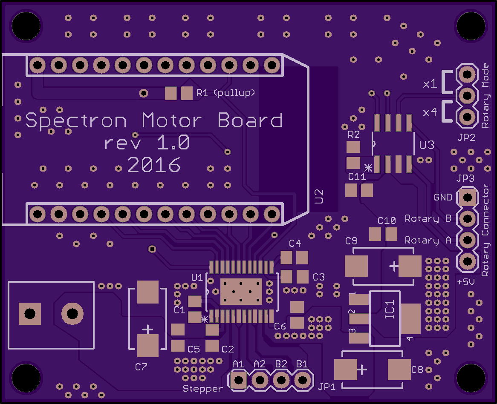
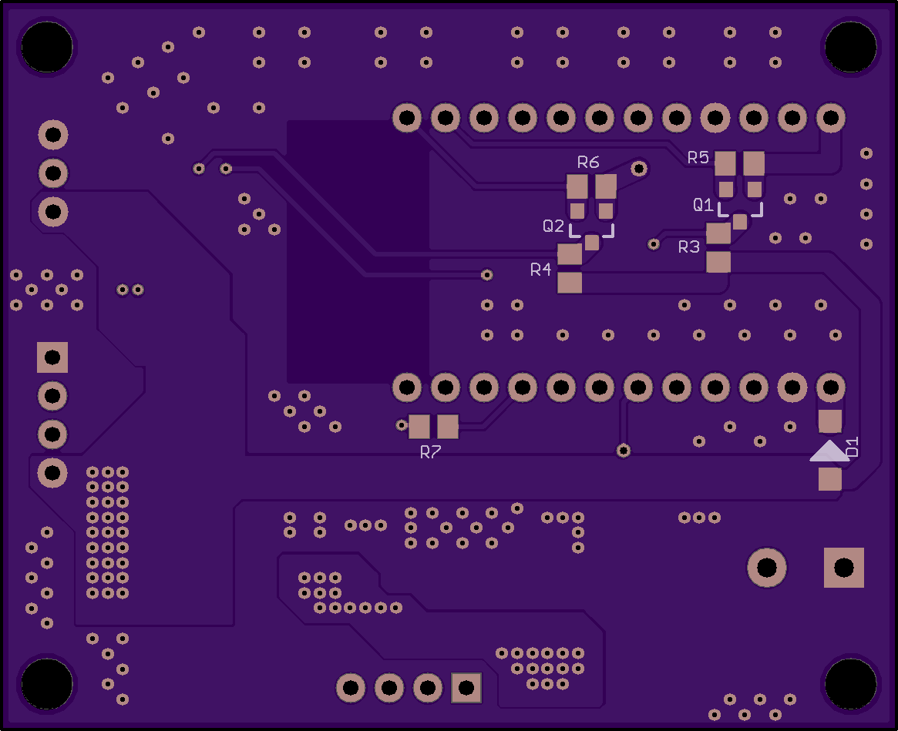

# Motor controller - programmable to scan of a range of wavelengths

This is the board that is responsible for monochromator automation. The board is capable of driving single stepper motor and receiving input from rotary encoder to help with position verification. The board requires minimum +12V DC power supply to operate. The board is also quite useful as standalone Particle Photon stepper driver.

Board schematic is also [available as standalone PDF](Motors.pdf). Bill of material [is available in Excel format](Motors_BOM.xlsx).

The following are the board layouts available (generated by OSH Park preview):

* Spectron 2 Motors - front and back

 

