# Hardware

All the custom made circuits and boards were designed in [Cadsoft Eagle](http://www.autodesk.com/products/eagle/overview). All components for these were separated into standalone Eagle library for easier access. 

__Note:__ All the boards were tuned up for making with [OSH Park](https://oshpark.com/) - all relevant DRC and ERC rule checks were therefore applied an validated.

Following is the list of all boards used for this project.

# Spectron 2

This is the main board that is responsible for spectral measurements. The board has analogue circuitry to drive Hamamatsu [C12666MA](http://www.hamamatsu.com/jp/en/C12666MA.html) or [C12880MA](http://www.hamamatsu.com/jp/en/C12880MA.html) micro spectrometers and interfaces to trigger external devices or light sources simultaneously with measurements. The board requires +5V DC power supply to operate.

The board also has a multipurpouse interface connector suitable for custom adaptations that provides access to SPI, I2C and generic digital/analogue pins on Particle Photon. This project does not make use of this connector but example firmware is provided to demonstrate its use with Adafruit 2.2" 18-bit TFT LCD module.

Board schematic is also [available as standalone PDF](Spectron2.pdf).

The Hamamatsu C12666MA and C12880MA spectrometers have different hardware pinout and for that reason they are attached to this board through their own little sensor boards. Those were designed with my specific attachment to integrating sphere in mind and come in both vertical and horisontal layouts (they differ in a way the main board attaches to the sensor board).

The following are the board layouts available (generated by OSH Park preview):

* Spectron 2 - front and back

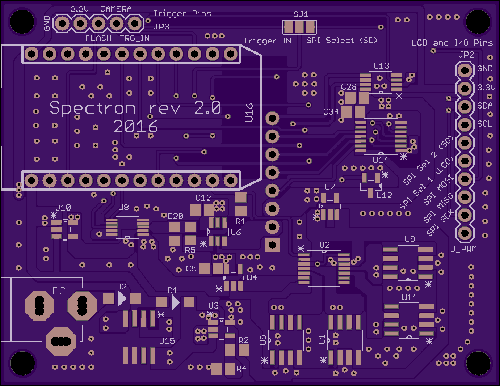 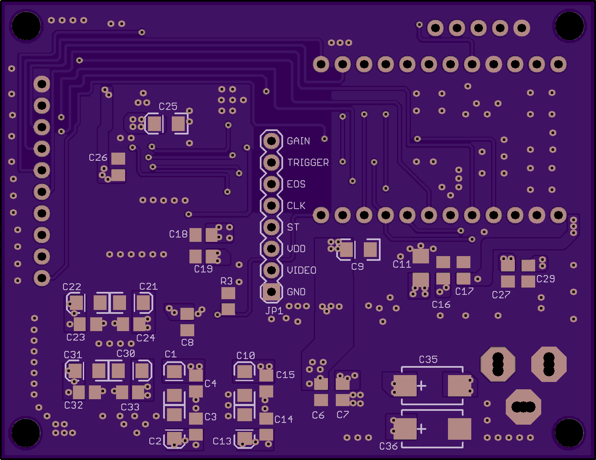

* Hamamatsu C12666 sensor board (horisontal) - front and back

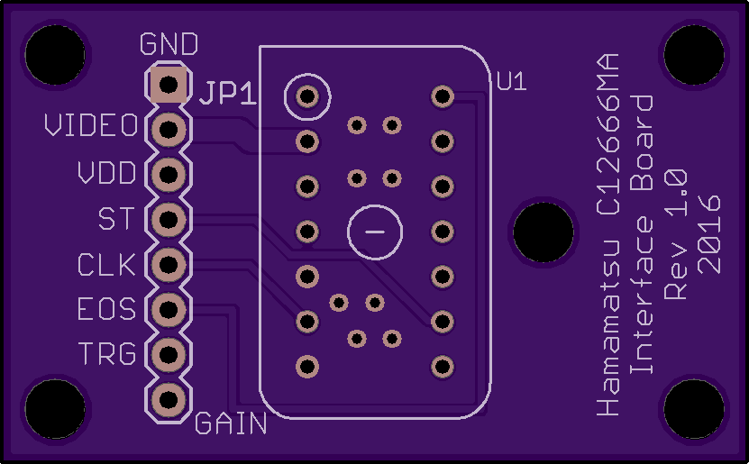 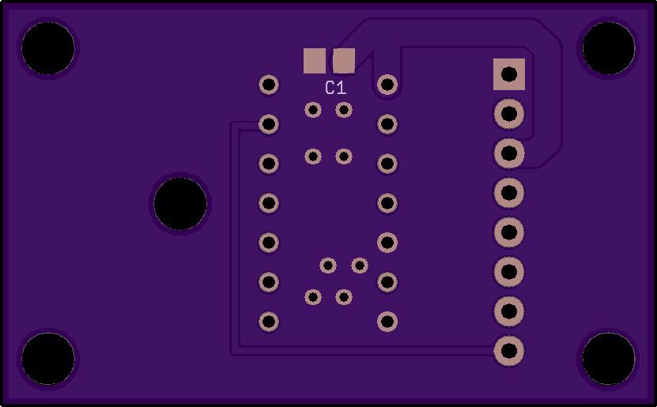

* Hamamatsu C12666 sensor board (vertical) - front and back

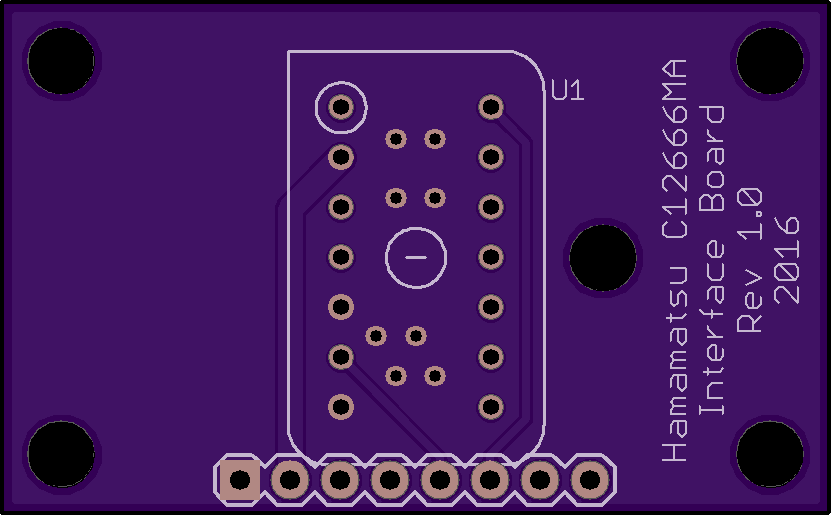 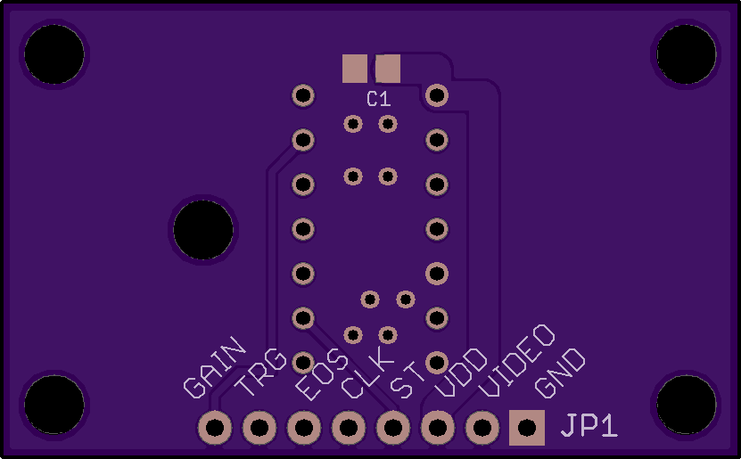

* Hamamatsu C12880 sensor board (horisontal) - front and back

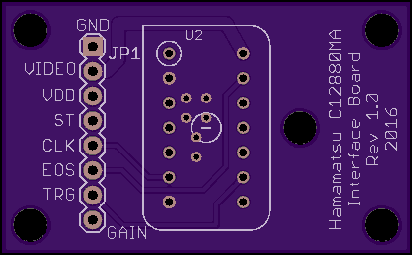 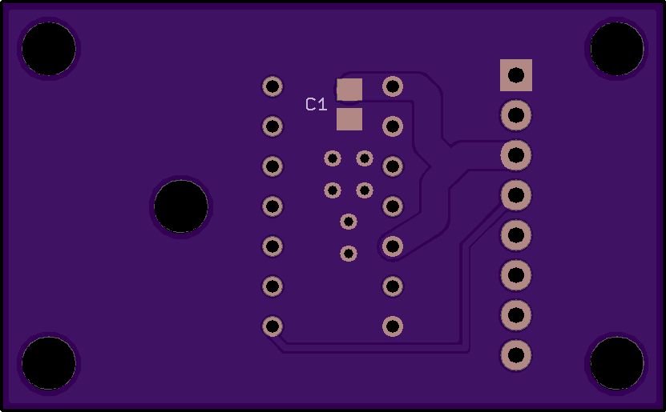

* Hamamatsu C12880 sensor board (vertical) - front and back

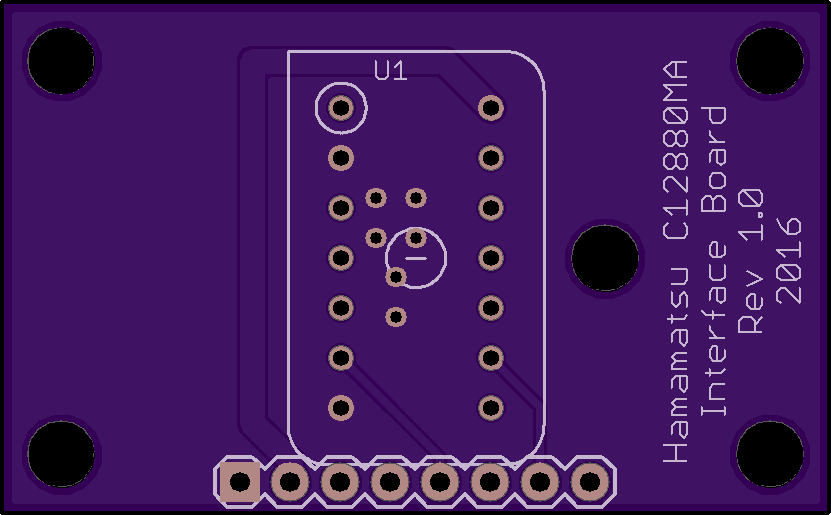 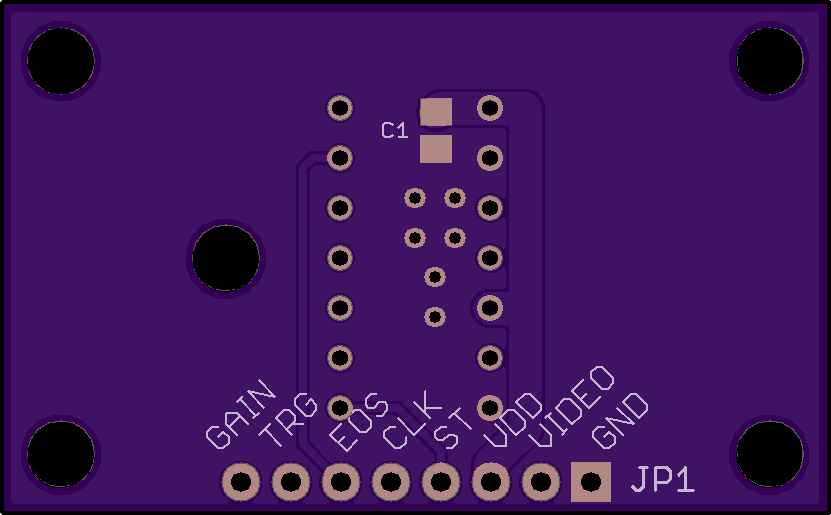

# Motors

This is the board that is responsible for monochromator control and positioning. The board is capable of driving single stepper motor and receiving input from rotary encoder to help with position verification. The board requires minimum +12V DC power supply to operate. The board is also quite useful as standalone Particle Photon stepper driver.

Board schematic is also [available as standalone PDF](Motors.pdf).

The following are the board layouts available (generated by OSH Park preview):

* Spectron 2 Motors - front and back

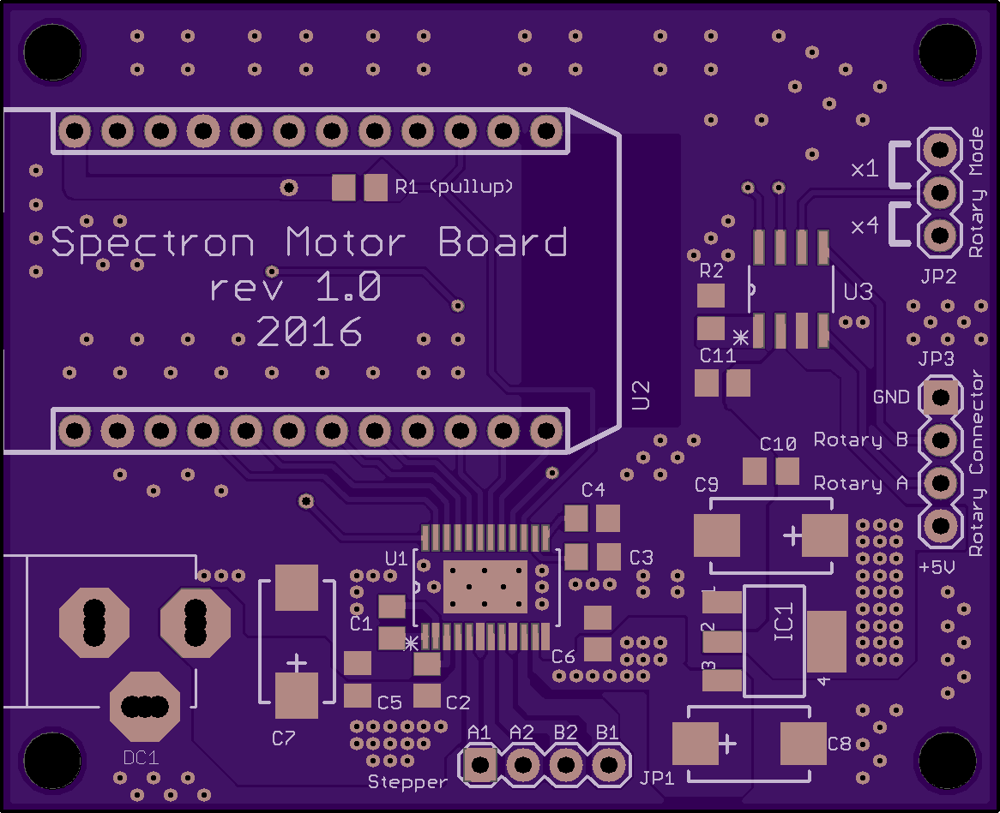 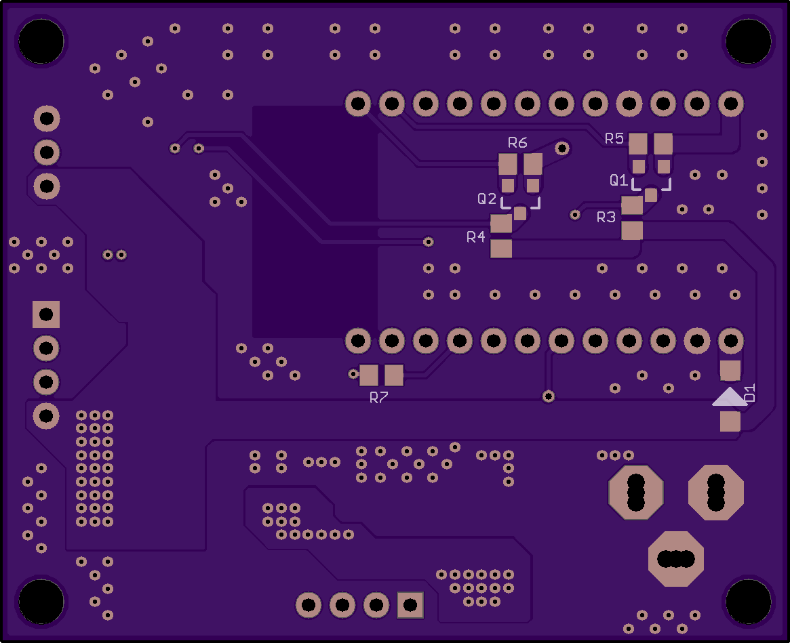

# Flash

A ready [available kit from Xenon Flash Tubes](http://www.xenonflashtubes.com/optical-flash.html) was used as a ight source for this project. I have used different (spiral 100ws) flash tube instead the one supplied with kit. Also as specified in this kit instructions, MOC3020 optocoupler was used to control flash from Spectron 2 board.

