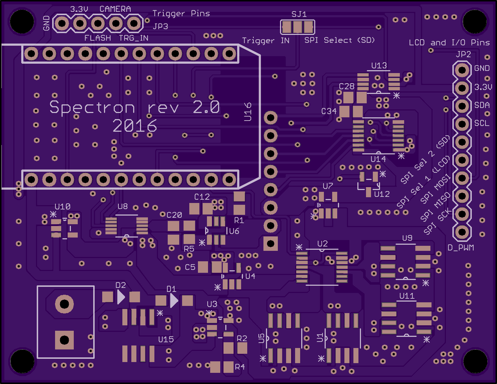
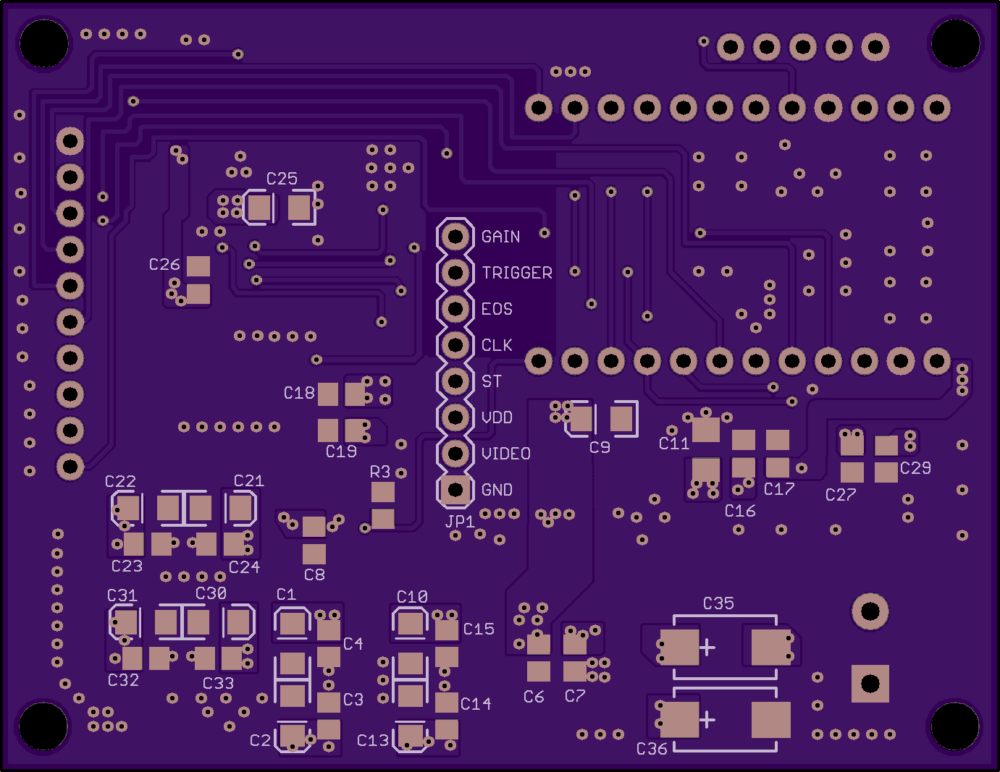
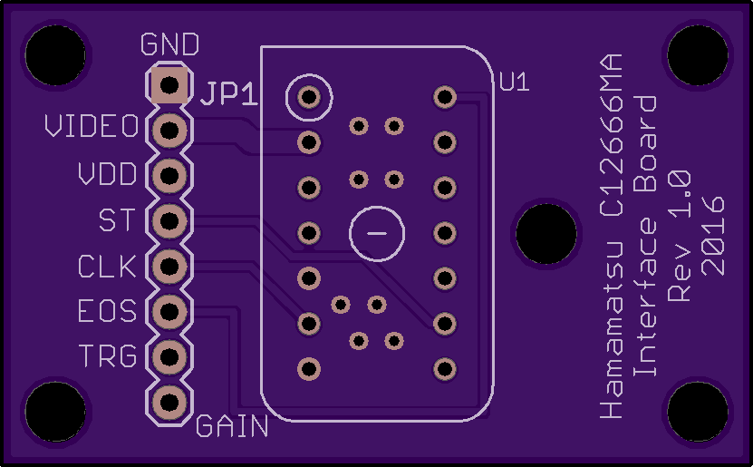
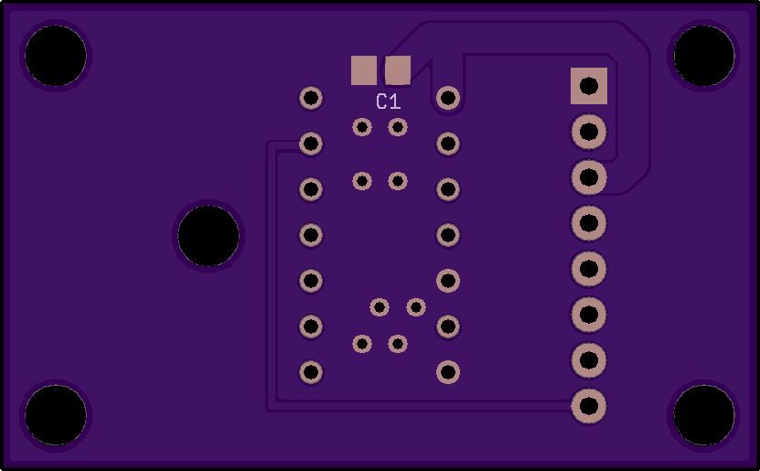
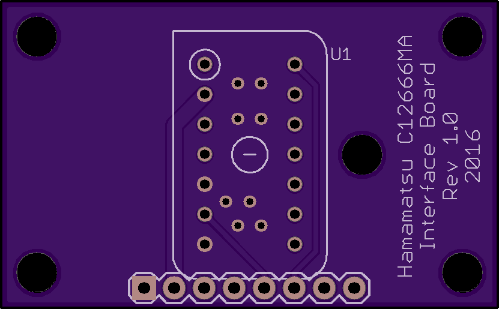
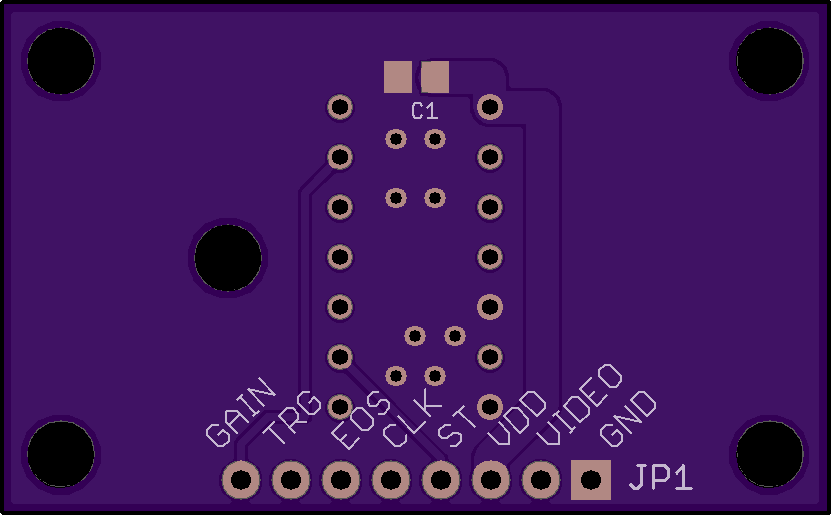
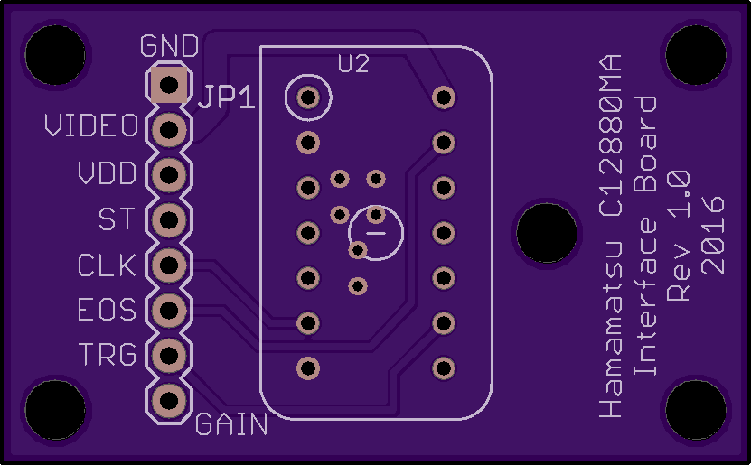
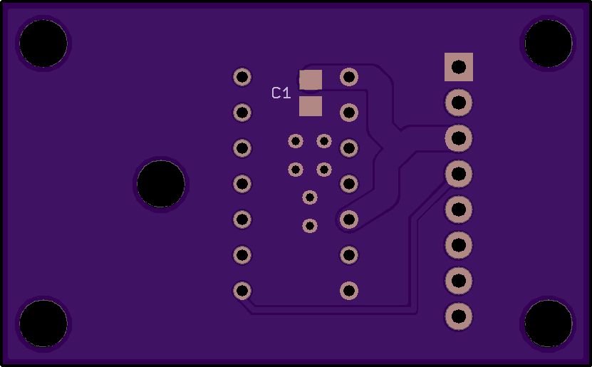
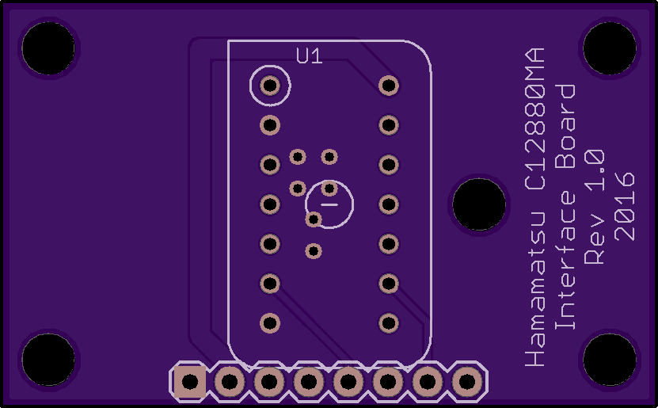
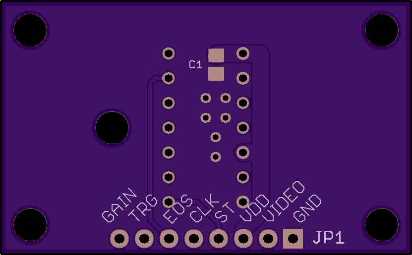

# Spectron 2 - Spectrometer controlling board

This is the main board that is responsible for spectral measurements. The board has analogue circuitry to drive Hamamatsu [C12666MA](http://www.hamamatsu.com/jp/en/C12666MA.html) or [C12880MA](http://www.hamamatsu.com/jp/en/C12880MA.html) micro spectrometers and interfaces to trigger external devices or light sources simultaneously with measurements. The board requires +5V DC power supply to operate.

The board also has a multipurpouse interface connector suitable for custom adaptations that provides access to SPI, I2C and generic digital/analogue pins on Particle Photon. This project does not make use of this connector but example firmware is provided to demonstrate its use with Adafruit 2.2" 18-bit TFT LCD module.

Board schematic is also [available as standalone PDF](Spectron2.pdf). Bill of material [is available in Excel format](Spectron2_BOM.xlsx).

The Hamamatsu C12666MA and C12880MA spectrometers have different hardware pinout and for that reason they are attached to this board through their own little sensor boards. Those were designed with my specific attachment to integrating sphere in mind and come in both vertical and horisontal layouts (they differ in a way the main board attaches to the sensor board).

The following are the board layouts available (generated by OSH Park preview):

* Spectron 2 - front and back

 

* Hamamatsu C12666 sensor board (horisontal) - front and back

 

* Hamamatsu C12666 sensor board (vertical) - front and back

 

* Hamamatsu C12880 sensor board (horisontal) - front and back

 

* Hamamatsu C12880 sensor board (vertical) - front and back

 

