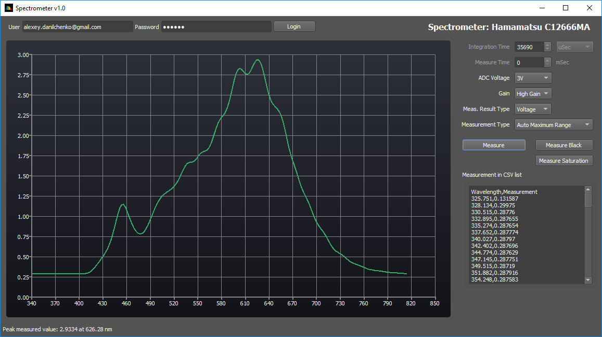
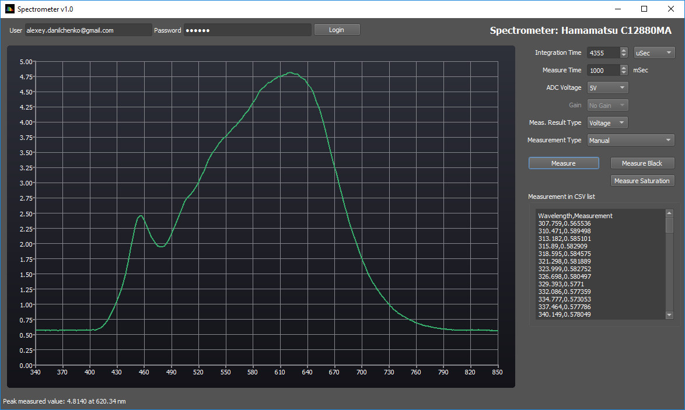

# Software

*Whilst the Spectron software is being developed and not available yet, I am releasing sample Spectrometer Application here*. 

The SpectrometerApp can operate Spectron board with Hamamatsu C12666 or C12880 sensors remotely via Particle cloud and fully control the Spectrometer operational parameters. The application exercise all Spectrometer board functionality including automatic exposure methods.

Sample screenshotts of the automatic measurements:

for Hamamatsu C12666MA spectrometer:

 

for Hamamatsu C12880MA spectrometer:

 

The SpectrometerApp is written using QT 5.10 and project files are binaries are provided for Windows. It should be fairly easy exercise to compile this on Linux or MacOS platform.
