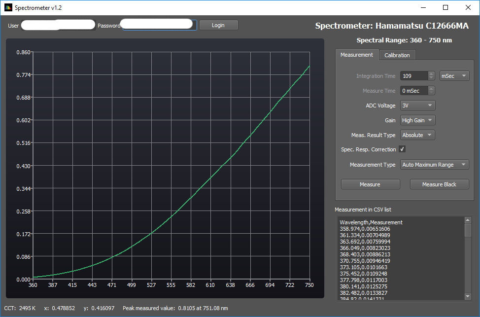

# Software

*Whilst the Spectron software is being developed and not available yet, I am releasing sample Spectrometer Application here*. 

The SpectrometerApp can operate Spectron board with Hamamatsu C12666 or C12880 sensors remotely via Particle cloud and fully control the Spectrometer operational parameters. The application exercise all Spectrometer board functionality including automatic exposure methods.

The SpectrometerApp allows to use, control and setup the following properties of the Hamamatsu spectrometers:

* Full set of parameters affecting measurement (ADC reference, gain)
* Automatic measurement
* Calculation of CCT, x, y colour metrics for emissive measurements
* Setting/limiting spectrometer range
* Calibration of saturation voltages
* Calibration of black levels
* Correction of spectral response curve

Sample screenshots:

Calibration page for Hamamatsu C12666MA spectrometer with spectral response normalisation curve:

 

Automatic measurement of the incandescent lamp (spectrally normalised response) for Hamamatsu C12666MA spectrometer:

 

Automatic raw measurement of the incandescent lamp (no spectral normalisation applied) for Hamamatsu C12666MA spectrometer:

 

The SpectrometerApp is written using QT 5.10 with project files are binaries provided for Windows 64 bit platform. It should be fairly easy to compile this on Linux or MacOS platform.
